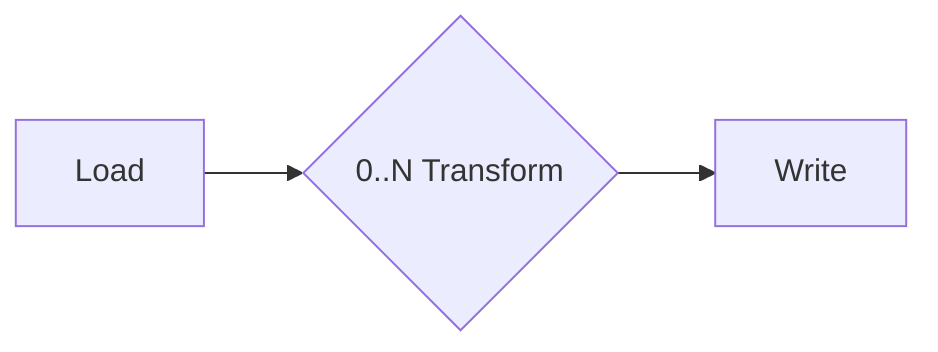

<div align="center">
  
</div>

# Lakehouse Plumber

*Because every Lakehouse needs a good plumber to keep the flows running smoothly* 🚰

**Generate readable, debuggable Python for Databricks Lakeflow Declarative Pipelines (formerly DLT) from concise YAML.** LHP is a code generator, not a runtime framework — the Python it produces is exactly what executes in your workspace, with no `import lhp` and no metadata-interpretation layer.

<div align="center">

[](https://badge.fury.io/py/lakehouse-plumber)
[](https://github.com/Mmodarre/Lakehouse_Plumber/actions/workflows/python_ci.yml)
[](https://opensource.org/licenses/Apache-2.0)
[](https://codecov.io/gh/Mmodarre/Lakehouse_Plumber)
[](https://lakehouse-plumber.readthedocs.io/)
[](https://www.databricks.com/product/data-engineering)
[](https://pepy.tech/projects/lakehouse-plumber)

</div>

## What it looks like

This 10-line FlowGroup, plus a reusable 51-line ingestion template, generates 81 lines of production Python:

<table>
<tr>
<th>Input — <code>part_ingestion.yaml</code> (10 lines)</th>
<th>Output — <code>part_ingestion.py</code> (81 lines, abridged)</th>
</tr>
<tr>
<td valign="top">

```yaml
pipeline: acmi_edw_raw
flowgroup: part_ingestion

use_template: json_ingestion_template
template_parameters:
  table_name: part_raw
  landing_folder: part
  schema_file: part_schema
```

</td>
<td valign="top">

```python
from pyspark.sql import functions as F
from pyspark import pipelines as dp

part_cloudfiles_schema_hints = """
    p_partkey BIGINT NOT NULL, p_name STRING NOT NULL,
    p_mfgr STRING NOT NULL, ...
""".strip().replace("\n", " ")

@dp.temporary_view()
def v_part_raw_cloudfiles():
    df = (spark.readStream.format("cloudFiles")
        .option("cloudFiles.format", "json")
        .option("cloudFiles.schemaHints", ...)
        .load("/Volumes/.../part/*.json"))
    df = df.withColumn("_processing_timestamp", F.current_timestamp())
    return df

dp.create_streaming_table(name="...part_raw", ...)

@dp.append_flow(target="...part_raw", name="f_part_raw_cloudfiles")
def f_part_raw_cloudfiles():
    return spark.readStream.table("v_part_raw_cloudfiles")
```

</td>
</tr>
</table>

**Measured ratio: ~8x per FlowGroup**, with the 51-line template amortized across every JSON ingestion in the project. Ten new tables of the same shape cost ~100 lines of YAML; you still get 810 lines of production-grade Python with schema hints, append-flow registration, and operational metadata columns. *(Numbers measured from `tests/e2e/fixtures/testing_project/`.)*

## When to use LHP vs. alternatives

| If you are doing this... | Use | Why |
|---|---|---|
| Hand-writing repetitive DLT Python across many bronze/silver tables | **LHP** | LHP generates the boilerplate; you keep the readable output |
| Using **dlt-meta** | LHP — if you value static, debuggable Python in your repo | dlt-meta interprets metadata at *runtime* inside the DLT pipeline; LHP generates static Python *before* deployment. You read the code that runs, debug it in the IDE, and Databricks Assistant sees normal Python |
| Using **dbt** for gold/semantic models | **Both** — LHP for bronze/silver ingestion + CDC, dbt for SQL transformations on top | dbt does not handle streaming, Auto Loader, CDC apply-changes, or SCD — LHP does. They compose; they don't compete |
| Hand-writing raw **Lakeflow Declarative Pipelines (DLT)** | **LHP** if you have >10 similar tables | At low scale raw DLT is simpler. Past a dozen tables, the boilerplate is the problem LHP exists to solve |
| Using **Databricks Asset Bundles (DABs)** for deployment | **Both** — they compose | DABs deploys; LHP generates the Python that DABs deploys. `lhp init` produces a DAB-ready project by default |

LHP is **not** a runtime framework. There is no `import lhp` in any generated file, no agent process, no metadata table interpreted at pipeline-startup. The output is the same Python you would have written by hand — just with the boilerplate removed.

## Install and ship your first pipeline

```bash
pip install lakehouse-plumber
lhp init my_project              # bundle-ready by default; --no-bundle to opt out
cd my_project
lhp generate --env dev           # YAML in, Python out
```

That's it. Edit YAML files under `pipelines/`, point your Databricks Asset Bundle at the generated Python, and deploy with `databricks bundle deploy --target dev`.

> Optional: open the project in VS Code. `lhp init` wires `.vscode/settings.json` to seven JSON schemas, so you get IntelliSense, hover docs, and inline validation for every YAML file out of the box.

## The three things LHP does that nothing else does

### 1. Blueprint fan-out: one pipeline shape, many sites

The pattern that breaks every other metadata framework: stamp out the same bronze→silver→gold shape across 50 regional sites, tenants, or domains, without hand-maintaining 50 pipelines.

A Blueprint is a parameterised *shape* — multiple FlowGroups, their relationships, and the per-instance variables. An Instance file invokes the blueprint with a 4-line declaration:

```yaml
# pipelines/sites/site_alpha.yaml — 4 lines
use_blueprint: medallion_demo
parameters:
  site_name: site_alpha
  domain_id: ALPHA001
```

Two 4-line instance files × one 94-line blueprint = **6 generated Python files across 3 pipeline directories**, all sharing one source of truth. Add a 4-line `site_charlie.yaml` and you get three more generated files — no copy-paste, no fork-and-edit. (Verified in `src/lhp/core/services/blueprint_expander.py` and `tests/e2e/fixtures/testing_project/pipelines/10_blueprint_demo/`.)

### 2. Single pane of glass monitoring across every pipeline

Every Lakeflow / DLT pipeline emits an event log. Stitching those event logs together across an entire project — to feed a dashboard or an AI/BI metric — is a side project everyone starts and nobody finishes.

LHP ships it as a first-class output. Enable `event_log` in `lhp.yaml`, run `lhp generate`, and you get a deployable dashboard like this on day one:

<div align="center">
  
</div>

Under the hood, `lhp generate` emits:

- One **union notebook** with N independent streaming queries — one per event-log-enabled pipeline, each with its own checkpoint
- One **MVs-only DLT FlowGroup** with a pre-built `pipeline_run_summary` materialized view: pipeline name, run ID, status, duration, row metrics
- Optional **Databricks Jobs correlation** (state, start/end, duration) when `enable_job_monitoring: true`

Plug those into an AI/BI dashboard and you have project-wide observability — pipeline activity, health by domain, freshness, daily reliability — without writing the aggregation logic yourself. dlt-meta gives you per-pipeline event logs; LHP gives you the cross-pipeline rollup. (Logic in `src/lhp/core/services/monitoring_pipeline_builder.py`.)

### 3. Smart state: regenerate only what changed

LHP keeps a `.lhp_state.json` file alongside your project — a content-addressed manifest of every generated Python file, its source YAML, its SHA-256 checksum, and its upstream dependencies. The orchestrator builds a NetworkX DAG, compares checksums, and only regenerates files whose YAML *or whose dependencies' YAML* changed.

The practical consequence: in a large project, editing one bronze YAML re-generates that file plus its silver/gold descendants — not the whole project. Orphaned generated files (whose source YAML was deleted) are detected and cleaned up. CI/CD pipelines that re-emit unchanged files for unrelated edits stop doing so. (Logic in `src/lhp/utils/smart_file_writer.py` and `src/lhp/core/services/generation_planning_service.py`.)

## Core workflow

Every FlowGroup is a sequence of typed actions:


```mermaid
graph LR
    A[Load] --> B{0..N Transform}
    B --> C[Write]
```

The action sub-types cover everything Lakeflow SDP exposes:

| Action | Sub-types |
|---|---|
| **Load** | CloudFiles (Auto Loader), Delta (with CDF), JDBC, SQL, custom Python |
| **Transform** | SQL, Python, data-quality expectations, schema mapping, temp tables |
| **Write** | Streaming Table, Materialized View, Append Flow (multi-source fan-in), CDC (SCD Type 1 and 2), Snapshot CDC, Sink (Delta, Kafka, JDBC, REST) |
| **Test** | Row count, uniqueness, referential integrity, completeness, range, schema match, lookup validity, custom SQL, custom expectations |

The full action reference is in [the docs](https://lakehouse-plumber.readthedocs.io/en/latest/actions/index.html).

## Substitutions and secrets

LHP composes four substitution layers, in order:

```
%{local_var}  →  {{ template_param }}  →  ${env_token}  →  ${secret:scope/key}
```

`local_var` is per-FlowGroup. `template_param` is per-template-invocation. `env_token` comes from `substitutions/<env>.yaml` (one per environment — `dev.yaml`, `staging.yaml`, `prod.yaml`). `secret:scope/key` is compiled into a `dbutils.secrets.get()` call in the generated Python — **secret values never appear in YAML, never appear in generated source, and are resolved at pipeline runtime by Databricks**.

You can chain layers: an `env_token` can expand to a string containing a `secret:` reference. The substitution processor lives in `src/lhp/core/services/flowgroup_processor.py`.

## A real bronze ingestion FlowGroup

```yaml
pipeline: bronze_ingestion
flowgroup: customers
presets: [bronze_layer_defaults]

actions:
  - name: load_customers_autoloader
    type: load
    source:
      type: cloudfiles
      path: "${landing_path}/customers/*.parquet"
      schema_evolution_mode: addNewColumns
    target: v_customers_raw

  - name: write_customers_bronze
    type: write
    source: v_customers_raw
    write_target:
      type: streaming_table
      database: "${catalog}.${bronze_schema}"
      table: customers
      cluster_columns: [market_segment]
```

The `bronze_layer_defaults` preset injects table properties, comment templates, and operational metadata columns shared across every bronze table. The `${landing_path}`, `${catalog}`, and `${bronze_schema}` tokens come from `substitutions/dev.yaml`. Run `lhp generate --env dev`, get production-ready Python with Auto Loader options, schema hints, append-flow registration, and Delta table properties — all configured per your preset.

The [docs](https://lakehouse-plumber.readthedocs.io/) cover silver transforms (CDC, SCD Type 2, multi-source append flows), gold materialized views, and the full test-action catalog with examples.

## Project layout

```
my_project/
├── lhp.yaml                    # project config (catalog, monitoring, defaults)
├── pipelines/                  # FlowGroups grouped by pipeline directory
│   ├── bronze_ingestion/
│   │   ├── customers.yaml
│   │   └── orders.yaml
│   └── silver_transforms/
│       └── customer_dimension.yaml
├── templates/                  # parameterised action patterns (reused across FlowGroups)
├── presets/                    # standardisation snippets (bronze defaults, audit columns, …)
├── blueprints/                 # parameterised pipeline shapes (multi-site / multi-tenant)
├── substitutions/              # per-environment variable values
│   ├── dev.yaml
│   └── prod.yaml
├── schemas/                    # JSON / SQL schemas referenced by Auto Loader
├── expectations/               # JSON expectation files for data-quality transforms
├── .vscode/                    # IntelliSense settings (auto-generated by `lhp init`)
└── generated/                  # output — checked in, version-controlled, debuggable
```

## What's new

- **Lakeflow SDP migration** — generated code now uses `from pyspark import pipelines as dp` (Lakeflow Spark Declarative Pipelines API) instead of the legacy `import dlt` decorators
- **Sink writes** — Delta tables, Kafka, JDBC, REST APIs as terminal write targets
- **Multi-FlowGroup files** — one YAML can declare multiple FlowGroups under shared settings, cutting file count for large templated projects
- **Cross-pipeline monitoring** — event-log aggregation + run-summary MV + optional Jobs correlation, dashboard-ready
- **Pipeline & Job config** — per-environment overrides for compute, runtime, scheduling, notifications, permissions

The full [changelog](https://lakehouse-plumber.readthedocs.io/en/latest/changelog.html) follows Keep a Changelog.

## Documentation and community

- **[Quickstart](https://lakehouse-plumber.readthedocs.io/en/latest/quickstart.html)** — ship your first pipeline in 10 minutes
- **[Migrating from raw DLT](https://lakehouse-plumber.readthedocs.io/en/latest/migrate_from_dlt.html)** — what to port first, how presets map to your existing patterns
- **[Architecture](https://lakehouse-plumber.readthedocs.io/en/latest/architecture.html)** — execution model, the six reuse primitives, the generation pipeline
- **[Full docs](https://lakehouse-plumber.readthedocs.io/)** — every action, every YAML key, every error code

[Issues](https://github.com/Mmodarre/Lakehouse_Plumber/issues) for bugs and feature requests. [Discussions](https://github.com/Mmodarre/Lakehouse_Plumber/discussions) for design questions and best-practice exchange.

## License

Apache 2.0 — see [LICENSE](LICENSE).

<div align="center">

Built for Lakeflow Spark Declarative Pipelines.

</div>
