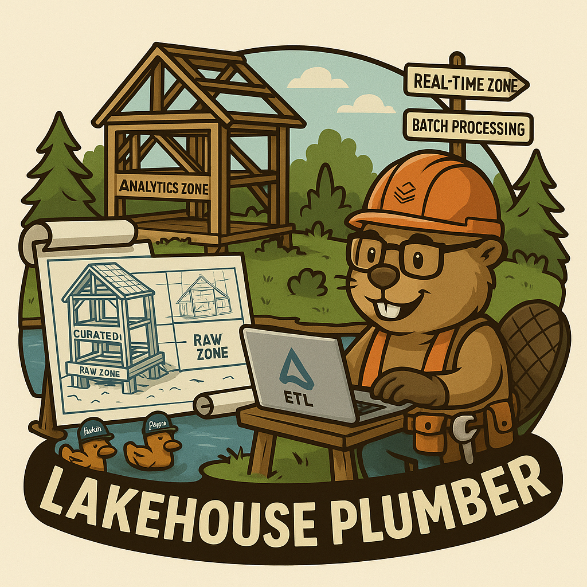

# Lakehouse Plumber
**Turn 4,300 lines of repetitive Python/SQL code into 50 lines of reusable YAML** 🚀

*Because every data lake needs a good plumber to keep the flows running smoothly!* 🚰

<div align="center">
  
</div>

<div align="center">

[](https://badge.fury.io/py/lakehouse-plumber)
[](https://github.com/Mmodarre/Lakehouse_Plumber/actions/workflows/python_ci.yml)
[](https://opensource.org/licenses/Apache-2.0)
[](https://github.com/Mmodarre/Lakehouse_Plumber)
[](https://codecov.io/gh/Mmodarre/Lakehouse_Plumber)
[](https://lakehouse-plumber.readthedocs.io/)
[](https://www.databricks.com/product/data-engineering)


</div>

**The YAML-driven Metadata framework for Databricks Lakeflow Declarative Pipelines (formerly Delta Live Tables)**

**The only Metadata framework that generates production ready Pyspark code for Lakeflow Declarative Pipelinee**

Transform repetitive data pipeline development with action-based configurations. Generate production-ready Python code from simple YAML definitions while maintaining full transparency and Databricks native features.

## ⚡ Why Lakehouse Plumber?

### Before: Repetitive Boilerplate Hell
```python
# customer_bronze.py (86 lines × 50 tables = 4,300 lines!)
from pyspark.sql import functions as F
import dlt

@dlt.view()
def v_customer_raw():
    """Load customer table from raw schema"""
    df = spark.readStream.table("acmi_edw_dev.edw_raw.customer")
    df = df.withColumn('_processing_timestamp', F.current_timestamp())
    return df

@dlt.view(comment="SQL transform: customer_bronze_cleanse")
def v_customer_bronze_cleaned():
    """SQL transform: customer_bronze_cleanse"""
    return spark.sql("""SELECT
      c_custkey as customer_id,
      c_name as name,
      c_address as address,
      -- ... 50+ more lines of transformations
    FROM stream(v_customer_raw)""")

# ... 50+ more lines of data quality, table creation, etc.
```

### After: One Reusable Template
```yaml
# templates/csv_ingestion_template.yaml (50 lines for ALL tables!)
name: csv_ingestion_template
description: "Standard template for ingesting CSV files"

parameters:
  - name: table_name
    required: true
  - name: landing_folder
    required: true

actions:
  - name: load_{{ table_name }}_csv
    type: load
    source:
      type: cloudfiles
      path: "{landing_volume}/{{ landing_folder }}/*.csv"
      format: csv
      schema_evolution_mode: addNewColumns
    target: v_{{ table_name }}_raw
    
  - name: write_{{ table_name }}_bronze
    type: write
    source: v_{{ table_name }}_raw
    write_target:
      type: streaming_table
      database: "{{ catalog }}.{{ bronze_schema }}"
      table: "{{ table_name }}"
```

#### Plus 5 lines for each table
```yaml
pipeline: raw_ingestions
flowgroup: customer_ingestion

use_template: csv_ingestion_template
template_parameters:
  table_name: customer
  landing_folder: customer
  table_properties:
    PII: "true"
```


## 🎯 Key Benefits

✅ **Eliminate 95% of Repetitive Code** - One template replaces hundreds of nearly-identical files  
✅ **Standardize Data Platform Quality** - Enforce consistent table properties, schemas, and patterns  
✅ **Maintain Full Transparency** - Generated Python is readable, version-controlled, and debuggable  
✅ **DataOps-Ready** - Built for CI/CD pipelines, automated testing, and multi-environment deployment  
✅ **Zero Runtime Overhead** - Pure Python generation, no compilation at runtime  
✅ **Databricks Native** - Works with Unity Catalog, Lakeflow UI, and Databricks Assistant  
✅ **No Vendor Lock-in** - Output is standard Python & SQL you control  

## 🏗️ Core Features

### 🔄 Action-Based Architecture

Build pipelines using composable **Load**, **Transform**, and **Write** actions:

#### Load Actions

- **CloudFiles**: Auto Loader for streaming files (JSON, Parquet, CSV, Avro, ORC, XML)
- **Delta**: Read from existing Delta tables with CDC support
- **JDBC**: Connect to external databases
- **SQL**: Execute custom SQL queries
- **Python**: Custom Python data sources

#### Transform Actions

- **SQL**: Standard SQL transformations
- **Python**: Custom Python transformations
- **Data Quality**: Apply expectations and validation rules
- **Schema**: Column mapping and type casting
- **Temp Table**: Create reusable temporary streaming tables

#### Write Actions

- **Streaming Table**: Live tables with change data capture
- **Materialized View**: Batch-computed analytics views

### 🎨 Template & Preset System

- **Templates**: Parameterized action patterns for common use cases
- **Presets**: Reusable configuration snippets for standardization
- **Environment Management**: Multi-environment support with variable substitution

### 🚀 Advanced Capabilities  

- **Append Flow API**: Efficient multi-stream ingestion with automatic table creation management
- **Smart Generation**: Content-based file writing - only regenerate what actually changed
- **Databricks Asset Bundles**: Full integration for enterprise deployment workflows
- **VS Code IntelliSense**: Complete auto-completion and validation for YAML configurations
- **Secret Management**: Secure credential handling with scope-based organization and `dbutils.secrets`
- **Operational Metadata**: Flexible metadata column creation

## 🚀 Quick Start

### Installation & Setup
```bash
# Install Lakehouse Plumber
pip install lakehouse-plumber

# Initialize new project
lhp init my_lakehouse_project --bundle
cd my_lakehouse_project

# Set up VS Code IntelliSense (optional)
lhp setup-intellisense
```

### Create Your First Pipeline
```yaml
# pipelines/bronze_ingestion/customers.yaml
  pipeline: tpch_sample_ingestion  # Grouping of generated python files in the same folder
   flowgroup: customer_ingestion   # Logical grouping for generated Python file

   actions:
      - name: customer_sample_load     # Unique action identifier
        type: load                     # Action type: Load
        readMode: stream              # Read using streaming CDF
        source:
           type: delta                # Source format: Delta Lake table
           database: "samples.tpch"   # Source database and schema in Unity Catalog
           table: customer_sample     # Source table name
        target: v_customer_sample_raw # Target view name (temporary in-memory)
        description: "Load customer sample table from Databricks samples catalog"

      - name: transform_customer_sample  # Unique action identifier
        type: transform                  # Action type: Transform
        transform_type: sql             # Transform using SQL query
        source: v_customer_sample_raw   # Input view from previous action
        target: v_customer_sample_cleaned  # Output view name
        sql: |                          # SQL transformation logic
           SELECT
           c_custkey as customer_id,    # Rename key field for clarity
           c_name as name,              # Simplify column name
           c_address as address,        # Keep address as-is
           c_nationkey as nation_id,    # Rename for consistency
           c_phone as phone,            # Simplify column name
           c_acctbal as account_balance, # More descriptive name
           c_mktsegment as market_segment, # Readable column name
           c_comment as comment         # Keep comment as-is
           FROM stream(v_customer_sample_raw)  # Stream from source view
        description: "Transform customer sample table"

      - name: write_customer_sample_bronze  # Unique action identifier
        type: write                         # Action type: Write
        source: v_customer_sample_cleaned   # Input view from previous action
        write_target:
           type: streaming_table            # Output as streaming table
           database: "{catalog}.{bronze_schema}"  # Target database.schema with substitutions
           table: "tpch_sample_customer"    # Final table name
        description: "Write customer sample table to bronze schema"
```

### Configure & Generate
```bash
# Configure environment variables
# Edit substitutions/dev.yaml with your settings

# Validate configuration
lhp validate --env dev

# Generate production-ready Python code
lhp generate --env dev --cleanup

# Deploy with Databricks Bundles (optional)
databricks bundle deploy --target dev
```

## 🏢 Enterprise Features

### Databricks Asset Bundles Integration
Full integration with Databricks Asset Bundles for enterprise-grade deployment:

```yaml
# databricks.yml - automatically detected
targets:
  dev:
    mode: development
    workspace:
      host: https://your-workspace.cloud.databricks.com
  prod:
    mode: production
    workspace:
      host: https://your-prod-workspace.cloud.databricks.com

resources:
  pipelines:
    bronze_ingestion:
      name: "bronze_ingestion_${bundle.target}"
      libraries:
        - file:
            path: ./generated/bronze_load
```

### Multi-Environment DataOps Workflow
```bash
# Development
lhp generate --env dev
databricks bundle deploy --target dev

# Staging  
lhp generate --env staging
databricks bundle deploy --target staging

# Production
lhp generate --env prod
databricks bundle deploy --target prod
```

## 📋 Complete CLI Reference

### 🚀 Project Lifecycle
```bash
lhp init <project_name>           # Initialize new project with best practices
lhp validate --env <env>          # Validate all configurations before generation  
lhp generate --env <env>          # Generate production-ready Python code
lhp info                          # Show project statistics and health metrics
```

### 🔍 Discovery & Debugging  
```bash
lhp list-presets                  # Browse available configuration presets
lhp list-templates                # Browse available pipeline templates
lhp show <flowgroup> --env <env>  # Debug resolved configuration with substitutions
lhp stats                         # Analyze project complexity and code metrics
```

### 🛠️ State & Maintenance
```bash
lhp generate --cleanup            # Clean up orphaned generated files
lhp state --env <env>             # View generation state and dependencies  
lhp state --cleanup --env <env>   # Remove stale state and orphaned files
```

### 🧠 VS Code Integration
```bash
lhp setup-intellisense           # Enable full YAML auto-completion
lhp setup-intellisense --check   # Verify system prerequisites
lhp setup-intellisense --status  # Show current IntelliSense status
lhp setup-intellisense --verify  # Test IntelliSense functionality
lhp setup-intellisense --cleanup # Remove IntelliSense configuration
```

## 📁 Project Structure

LakehousePlumber organizes your data pipeline code for maximum reusability and maintainability:

```
my_lakehouse_project/
├── 📋 lhp.yaml                    # Project configuration
├── 🎨 presets/                    # Reusable configuration standards
│   ├── bronze_layer.yaml          #   Bronze layer defaults  
│   ├── silver_layer.yaml          #   Silver layer standards
│   └── gold_layer.yaml            #   Analytics layer patterns
├── 📝 templates/                  # Parameterized pipeline patterns
│   ├── standard_ingestion.yaml    #   Common ingestion template
│   └── scd_type2.yaml             #   Slowly changing dimension template
├── 🔄 pipelines/                  # Your pipeline definitions  
│   ├── bronze_ingestion/          #   Raw data ingestion
│   │   ├── customers.yaml         #     Customer data flow
│   │   └── orders.yaml            #     Order data flow
│   ├── silver_transforms/         #   Business logic transformation
│   │   └── customer_dimension.yaml#     Customer dimensional model
│   └── gold_analytics/            #   Analytics and reporting
│       └── customer_metrics.yaml  #     Customer analytics
├── 🌍 substitutions/              # Environment-specific values
│   ├── dev.yaml                   #   Development settings
│   ├── staging.yaml               #   Staging settings  
│   └── prod.yaml                  #   Production settings
├── ✅ expectations/               # Data quality rules
│   └── customer_quality.yaml      #   Customer data validation
└── 🐍 generated/                  # Generated Python code (auto-managed)
    ├── bronze_load/               #   Generated bronze pipelines
    ├── silver_load/               #   Generated silver pipelines  
    └── gold_load/                 #   Generated analytics pipelines
```

## 🧠 VS Code IntelliSense Support

Get powerful auto-completion, validation, and documentation for all YAML files:

### Quick Setup
```bash
lhp setup-intellisense    # One-time setup
# Restart VS Code
```

### What You Get
- ⚡ **Smart Auto-completion** - Context-aware suggestions for all fields
- 🔍 **Real-time Validation** - Immediate error detection and feedback  
- 📖 **Inline Documentation** - Hover descriptions for every configuration option
- 🎯 **Schema Validation** - Ensures correct YAML structure

### Supported Files
- Pipeline configurations (`pipelines/**/*.yaml`)
- Templates (`templates/**/*.yaml`) 
- Presets (`presets/**/*.yaml`)
- Environment settings (`substitutions/**/*.yaml`)
- Project configuration (`lhp.yaml`)


## 👥 Who Should Use Lakehouse Plumber?

### 🏢 **Data Platform Teams**
- Standardize data engineering practices across the organization
- Enforce consistent quality, security, and operational patterns
- Reduce onboarding time for new data engineers

### 👨‍💻 **Data Engineers**  
- Eliminate repetitive boilerplate code and focus on business logic
- Accelerate development with templates and presets
- Maintain code quality with automated generation and validation

### 🚀 **DevOps/Platform Engineers**
- Implement Infrastructure as Code for data pipelines
- Enable GitOps workflows with transparent Python generation
- Integrate with existing CI/CD and Databricks Asset Bundles

### 📊 **Analytics Engineers**
- Build complex medallion architecture pipelines with simple YAML
- Implement advanced patterns like SCD Type 2 without coding complexity
- Focus on data modeling instead of infrastructure concerns

## 🎨 Advanced Patterns Made Simple

### Multi-Stream Table Creation
```yaml
# Handle multiple data sources writing to the same table
- name: write_orders_primary
  write_target:
    table: orders
    create_table: true    # Primary stream creates table
    
- name: write_orders_secondary  
  write_target:
    table: orders
    create_table: false   # Secondary streams append
```

### Data Quality Integration
```yaml
# Built-in data quality with expectations
- name: validate_customers
  type: transform
  transform_type: data_quality
  source: v_customers_raw
  expectations_file: "customer_quality.yaml"
```

<!-- ### Slowly Changing Dimensions
```yaml
# SCD Type 2 with Python transformations
- name: customer_scd2
  type: transform
  transform_type: python
  python_source: |
    def scd2_transform(df):
        return df.withColumn("__start_date", current_date()) \
                 .withColumn("__is_current", lit(True)) -->
<!-- ``` -->

## 🔧 Smart Multi-Stream Table Management

LakehousePlumber uses Databricks Append Flow API for efficient multi-stream ingestion:

### Simple Multi-Stream Setup
```yaml
# Multiple streams → Single table  
- name: write_orders_primary
  write_target:
    table: orders
    create_table: true    # ✅ One stream creates table

- name: write_orders_secondary  
  write_target:
    table: orders
    create_table: false   # ✅ Other streams append
```

### Generated Optimized Code
```python
# Single table creation
dlt.create_streaming_table(name="orders", ...)

# Multiple append flows (high performance)
@dlt.append_flow(target="orders", name="f_orders_primary")
def f_orders_primary():
    return spark.readStream.table("v_orders_primary")

@dlt.append_flow(target="orders", name="f_orders_secondary") 
def f_orders_secondary():
    return spark.readStream.table("v_orders_secondary")
```

### Benefits
✅ **Conflict Prevention** - Automatic validation ensures exactly one table creator  
✅ **High Performance** - Native Databricks Append Flow API  
✅ **Smart Generation** - Only regenerate files that actually changed  
✅ **Clear Error Messages** - Actionable validation feedback

## 📚 Real-World Examples

### 🥉 Bronze: Raw Data Ingestion
```yaml
pipeline: bronze_ingestion
flowgroup: orders
presets: [bronze_layer]

actions:
  - name: load_orders_autoloader
    type: load
    source:
      type: cloudfiles
      path: "{{ landing_path }}/orders/*.parquet"
      schema_evolution_mode: addNewColumns
    target: v_orders_raw
    
  - name: write_orders_bronze
    type: write
    source: v_orders_raw
    write_target:
      type: streaming_table
      table: "orders"
      cluster_columns: ["order_date"]
```

### 🥈 Silver: Business Logic & Transformations  
```yaml
pipeline: silver_transforms
flowgroup: customer_dimension

actions:
  - name: cleanse_customers
    type: transform
    transform_type: sql
    source: "{{ bronze_schema }}.customers"
    sql: |
      SELECT 
        customer_key,
        TRIM(UPPER(customer_name)) as customer_name,
        REGEXP_REPLACE(phone, '[^0-9]', '') as phone_clean,
        market_segment,
        account_balance
      FROM STREAM(LIVE.customers)
      WHERE customer_key IS NOT NULL
          
  - name: write_customer_dimension
    type: write
    source: v_customers_cleansed
    write_target:
      type: streaming_table
      table: "dim_customers"
      table_properties:
        quality: "silver"
```

### 🥇 Gold: Analytics & Reporting
```yaml
pipeline: gold_analytics  
flowgroup: customer_metrics

actions:
  - name: customer_lifetime_value
    type: transform
    transform_type: sql
    source: 
      - "{{ silver_schema }}.dim_customers"
      - "{{ silver_schema }}.fact_orders"
    sql: |
      SELECT 
        c.customer_key,
        c.customer_name,
        COUNT(o.order_key) as total_orders,
        SUM(o.total_price) as lifetime_value
      FROM LIVE.dim_customers c
      LEFT JOIN LIVE.fact_orders o USING (customer_key)
      WHERE c.__is_current = true
      GROUP BY c.customer_key, c.customer_name
      
  - name: write_customer_metrics
    type: write
    source: v_customer_ltv
    write_target:
      type: materialized_view
      table: "customer_metrics"
      refresh_schedule: "0 2 * * *"  # Daily at 2 AM
```

## 🚀 Get Started Today

Ready to eliminate repetitive data pipeline code? Choose your path:

### 🆕 New to Lakehouse Plumber
```bash
pip install lakehouse-plumber
lhp init my-first-project --bundle
cd my-first-project
lhp generate --env dev --cleanup
```

### 🏢 Enterprise Evaluation
- [📖 Read the complete documentation](https://lakehouse-plumber.readthedocs.io/)
- [🔬 Explore the ACME demo project](https://github.com/Mmodarre/acme_edw) 
- [💬 Join our community discussions](https://github.com/Mmodarre/Lakehouse_Plumber/discussions)

### 👥 Production Deployment  
- [🏗️ Databricks Asset Bundles integration](https://lakehouse-plumber.readthedocs.io/en/latest/databricks_bundles.html)
- [🔧 CI/CD best practices guide](https://lakehouse-plumber.readthedocs.io/en/latest/advanced.html)

## 🤝 Community & Support

### 💬 Get Help
- [📚 **Documentation**](https://lakehouse-plumber.readthedocs.io/) - Complete guides and API reference
- [🐛 **Issues**](https://github.com/Mmodarre/Lakehouse_Plumber/issues) - Bug reports and feature requests  
- [💭 **Discussions**](https://github.com/Mmodarre/Lakehouse_Plumber/discussions) - Community Q&A and best practices

### 🔧 Contributing  
We welcome contributions from the community! See our [development guide](https://lakehouse-plumber.readthedocs.io/en/latest/advanced.html#development) for:
- 🛠️ Setting up local development environment
- ✅ Running the comprehensive test suite  
- 📝 Contributing documentation and examples
- 🚀 Submitting features and improvements

## 📄 License & Acknowledgments

**Apache 2.0 License** - See [LICENSE](LICENSE) for details

Built with ❤️ for the Databricks ecosystem and modern data engineering practices. Special thanks to the Databricks team for Lakeflow Declarative Pipelines and the open-source community for continuous inspiration.

---

<div align="center">

**Transform your data pipelines today – [Get Started](https://lakehouse-plumber.readthedocs.io/en/latest/getting_started.html) 🚀**

</div>
