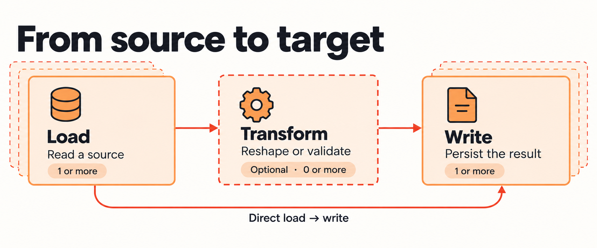
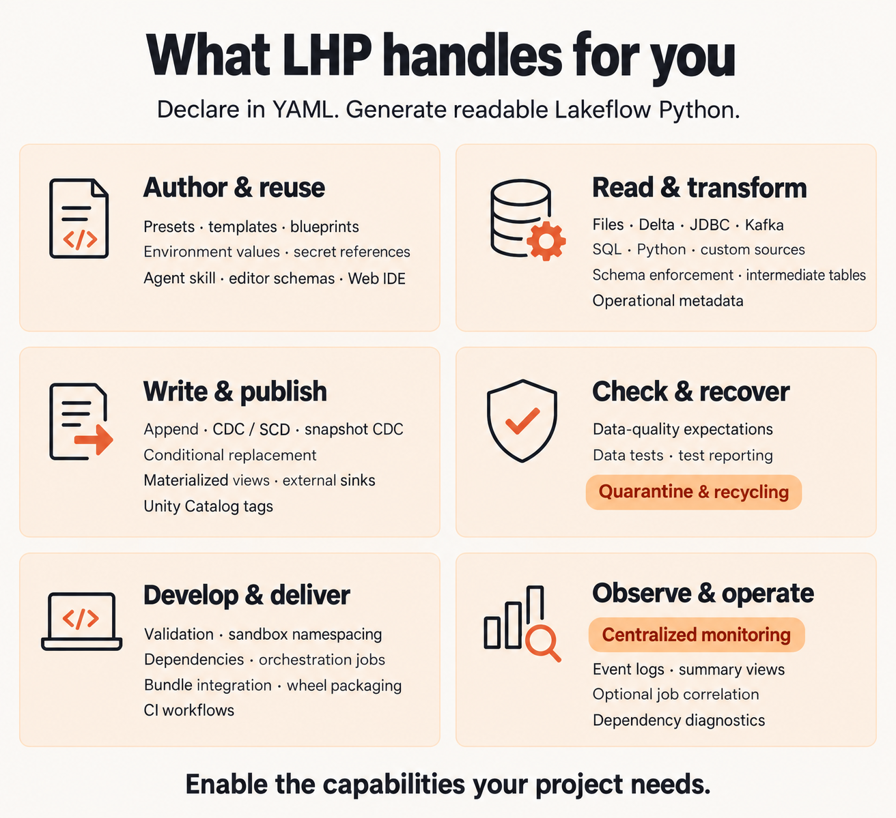

.. Lakehouse Plumber documentation master file

=================
Lakehouse Plumber
=================

.. meta::
   :description: Lakehouse Plumber turns concise YAML into readable Lakeflow Spark Declarative Pipelines — declare your ETL instead of hand-writing thousands of lines of PySpark.

**ETL at scale, the way it should be.**

Managing dozens of Lakeflow pipelines means writing — and rewriting — thousands
of lines of near-identical PySpark. The patterns repeat; only the table names
change. Lakehouse Plumber turns concise YAML **actions** into fully-featured
Lakeflow Spark Declarative Pipelines. You describe *what* each pipeline is —
a source to read, a table to write; LHP writes the *how* as plain, readable
Python you own and open in the Databricks editor. **Declare your ETL, don't
hand-write it.**

See it
======

The same ingest, three ways: the YAML you write, the Lakeflow code Lakehouse
Plumber generates from it, and the two commands that turn one into the other.

.. tab-set::

   .. tab-item:: You write — YAML

      Eighteen lines describe a ``load`` and a ``write``. The ``${...}`` tokens
      resolve per environment, so the same flowgroup runs unchanged in dev and
      prod.

      .. literalinclude:: _fixtures/first_pipeline/pipelines/bronze_ingest.yaml
         :language: yaml
         :caption: pipelines/bronze_ingest.yaml

   .. tab-item:: LHP generates — Lakeflow

      Ordinary Lakeflow Python — a temporary view for the source, a streaming
      table for the target, an append flow wiring them together. Nothing hidden
      behind a runtime; you could have written it by hand, but you didn't.

      .. literalinclude:: _fixtures/first_pipeline/generated/dev/bronze_ingest/orders_ingest.py
         :language: python
         :caption: generated/dev/bronze_ingest/orders_ingest.py

   .. tab-item:: You run — CLI

      Validate resolves every token and checks the actions; generate writes the
      Python.

      .. code-block:: console

         $ lhp validate --env dev
         ✓ discover (0.01s)
         ✓ bronze_ingest  0 files
         ✓ validate (0.38s)
         1 validated · 0.4s

         $ lhp generate --env dev
         ✓ discover (0.01s)
         ✓ bronze_ingest  1 file
         ✓ generate (0.41s)
         1 pipeline generated · 1 file · 0.5s

The payoff compounds. Adding a data-quality check, a second table, or a CDC
merge is a few more lines of YAML — not another fifty lines of Python each time.
The :doc:`Get Started course <get-started/index>` walks through a complete
sample project. Then :doc:`build/first-pipeline` helps you author your own.

The model
=========

A common data-flow shape combines one or more loads, zero or more transforms,
and one or more writes. Actions connect through the views they read and produce.

   Dotted cards represent additional loads and writes. Transforms are optional,
   so a load can feed a write directly. Select the diagram to view it full size.

What LHP handles for you
========================

Start with a source and a target, then enable the capabilities your project
needs. Monitoring and quarantine extend the same declarative approach to
operating pipelines and recovering rejected rows.

cycling; develop and deliver with validation, sandboxing, jobs, bundles and CI; observe and operate with centralized event logs, summary views and optional job correlation.
   :width: 100%
   :figclass: lhp-diagram

   LHP generates the code and configuration for the capabilities you enable.
   Select the diagram to view it full size.

- **Author and reuse:** :doc:`build/compose`,
  :doc:`environment values and secrets <guides/reuse-and-scale/substitutions-and-secrets>`.
- **Read and transform:** :doc:`sources <guides/ingest/index>`,
  :doc:`transformations <guides/transform/index>`, :doc:`build/metadata`.
- **Write and publish:** :doc:`streaming tables, views and sinks <guides/write/index>`.
- **Check and recover:** :doc:`data quality <guides/transform/data-quality>`,
  :doc:`quarantine and recycling <guides/transform/quarantine>`.
- **Develop and deliver:** :doc:`develop/index`.
- **Observe and operate:** :doc:`centralized monitoring <guides/ops/monitoring>`,
  :doc:`dependency diagnostics <guides/ops/dependency-analysis>`.

Where to next
=============

.. grid:: 1 1 2 2
   :gutter: 3

   .. grid-item-card:: Get Started
      :link: get-started/index
      :link-type: doc

      Run the existing sample course from installation through deployment.

   .. grid-item-card:: Build pipelines
      :link: build/index
      :link-type: doc

      Build with your own data: configure, read, transform, write and check quality.

   .. grid-item-card:: Develop and deploy
      :link: develop/index
      :link-type: doc

      Develop locally, configure bundles, schedule jobs and deploy through CI.

   .. grid-item-card:: Monitor and troubleshoot
      :link: operate/index
      :link-type: doc

      Enable monitoring, adjust its settings and diagnose problems by symptom.

   .. grid-item-card:: Reference
      :link: reference/index
      :link-type: doc

      Find exact action syntax and configuration options by feature or filename.

.. admonition:: Coming from DLT?
   :class: tip

   Already have Delta Live Tables pipelines? See
   :doc:`Migrate a DLT pipeline to Lakehouse Plumber <guides/ship/migrate-from-dlt>`.

.. toctree::
   :maxdepth: 2
   :hidden:
   :caption: Documentation

   get-started/index
   build/index
   develop/index
   operate/index
   reference/index
